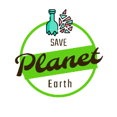
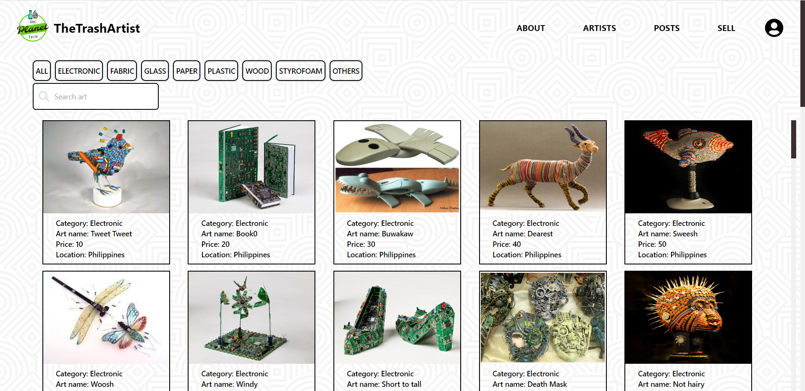

  

<!-- PROJECT LOGO -->
 

  <h1 align="center"></h1>
    

<!-- ABOUT THE PROJECT -->
## About The Project
Thetrashartist web app is designed to help users to buy and sell their arts.
The app is intuitive and user-friendly, allowing users to easily search for different arts based on various criteria such as electronic, fabric, glass, paper, plastic, wood, styrofoam and others.
         

## Features:
•Users can put their art on sale on sell page option.  
•Users can view the registered artists.  
•Users can also easily sort and filter the results based on their preferences  

## Wireframe
Wireframe link: https://www.figma.com/file/yFR7ZcLe38mcmsm5uBQGQW/Untitled?type=design&node-id=0-1&t=jwCHLs5lfyS5hkk1-0

(<a href="#readme-top">back to top</a>)

### This Project is Built With

  
  
  
  
  
  
  
 

(<a href="#readme-top">back to top</a>)

<!-- USAGE EXAMPLES -->
## Webapp Sample

(<a href="#readme-top">back to top</a>)

<!-- CONTRIBUTING -->
## Contributing

Contributions are what make the open source community such an amazing place to learn, inspire, and create. Any contributions you make are **greatly appreciated**.

If you have a suggestion that would make this better, please fork the repo and create a pull request. You can also simply open an issue with the tag "enhancement".
Don't forget to give the project a star! Thanks again!

1. Fork the Project
2. Create your Feature Branch (`git checkout -b feature/AmazingFeature`)
3. Commit your Changes (`git commit -m 'Add some AmazingFeature'`)
4. Push to the Branch (`git push origin feature/AmazingFeature`)
5. Open a Pull Request

(<a href="#readme-top">back to top</a>)

<!-- LICENSE -->
## License

Distributed under the MIT License. See `LICENSE.txt` for more information.

(<a href="#readme-top">back to top</a>)

<!-- CONTACT -->
## Contact

[Linkedin](https://www.linkedin.com/in/celso-diamante-0b8b8325b/)

Project Link: [https://github.com/Celso280/thetrashartist](https://github.com/Celso280/thetrashartist)

(<a href="#readme-top">back to top</a>)

<!-- ACKNOWLEDGMENTS -->
## Acknowledgments

I've included a few of my favorites to kick things off!

* [TailwindComponents](https://tailwindcomponents.com/)
* [Flowbite](https://flowbite.com/)
* [Youtube Tutorial](https://www.youtube.com/@codecommerce)
* [Pexels](https://www.pexels.com/)
* [Background](https://www.toptal.com/designers/subtlepatterns/  )
* [React Icons](https://react-icons.github.io/react-icons/search)

(<a href="#readme-top">back to top</a>)
